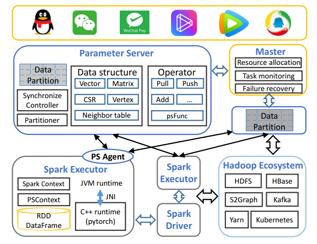

# Angel-Graph

如今，我们身处万物互连的复杂网络世界，人和人、人和物、物和物之间的关系也变得更加复杂多样化，现实中许多问题都可以抽象为图来表达，通过传统图挖掘、图表示学习和图神经网络等图技术，我们可以从海量关系结构的数据中挖掘丰富的信息，以弥补单点分析的不足，最终对金融支付、安全风控、推荐广告等诸多业务场景产生助力。

## 概览

Angel Graph吸收了Angel参数服务器以及Spark、PyTorch优势，使得传统图计算、图表示学习和图神经网络“三位一体”，实现了高性能、高可靠、易用的大规模分布式图计算框架。

Angel Graph有以下核心能力：

- 复杂异构网络。工业界的图数据组成复杂多样，数据规模往往具有十亿级顶点、百亿甚至千亿级边。Angel Graph通过Spark On Angel或Pytorch进行分布式训练，可以轻松支持十亿级顶点、千亿级边的大规模图计算。
- 端到端的图计算。工业界的大数据生态多为Spark、Hadoop。Angel Graph基于Spark On Angel的架构，可以无缝衔接Spark，以便利用Spark 的ETL能力，支持端到端的图学习。
- 传统图挖掘。支持十亿级顶点、千亿级边的传统图算法，如PageRank、Kcore分析节点重要性，Louvain进行社区发现等。提供对顶点的测度分析和丰富的图特征，以便应用到机器学习或推荐风控等业务模型中。
- 图表示学习。支持十亿级顶点，千亿级边的Graph Embedding算法，如LINE、Word2Vec等。
- 图神经网络。支持十亿级顶点，数百亿边的图神经网络算法，利用顶点或边上丰富的属性信息进行深度学习。

## 系统介绍

如下图所示，Angel Graph利用Spark和Pytorch，下层Spark Worker，上层为Angel参数服务。

Angel Graph中的Spark On Angel模块将Angel灵活的参数服务器插件式地赋能给原生Spark，为Spark提供了高效的数据存储/更新/共享服务，因而非常适用于分布式图计算框架。同时Spark On Angel又沿用了原生Spark的变成接口，使得在该框架上的算法开发可以利用Spark的能力。

#### Spark组件

- Spark Driver:负责控制整体计算逻辑

- Spark Executor：在进行传统图计算和图表示学习时，Spark Executor**存储图邻接表/边表**等不可变的数据结构，在每轮迭代中从PS拉取(pull)所需的节点属性等数据，在本地完成计算后将结果推送(push)回PS，交由PS进行更新。在图神经网络算法训练时，Pytorch C++后端作为实际的计算引擎以native的方式运行在Spark Executor中

#### Angel组件

- Angel Master：管理参数服务器的生命周期
- Angel PS(Parameter Server)：将节点属性等可变数据以向量的抽象形式储存（**支持存储自定义的元素数据结构，支持负载均衡分区**），通过Angel特有的PS函数实现节点属性in-place更新及其他根据特定算法定制的灵活计算
- Angel Agent：作为代理桥接Spark Executor和Parameter Server

#### Pytorch组件

Python Client：利用TorchScript语法编写算法模型，交给Spark Executor加载，并通过Angel PS完成模型的分布式训练和预测。

## 内置图算法

为了方便使用图计算框架，我们实现了许多常用图算法，并且在内部业务中进行了充分测试，保证了算法的运行效率和正确性。用户使用时无需过多调整，便可快速使用。

| 算法名称                   | 算法类型       | 说明                                  |
| -------------------------- | -------------- | ------------------------------------- |
| PageRank                   | 节点重要性计算 | 经典的传统图算法                      |
| Hindex                     | 节点重要性计算 | 混合量化指标，参考H指数               |
| Kcore                      | 节点特征       | 提取网络中关键子结构                  |
| Louvain                    | 社区发现       | 通过优化模块度指标达到社区划分的目的  |
| Closeness                  | 接近中心性     | 度量顶点在图中的中心程度              |
| CommonFriends              | 共同好友计算   | 计算两个顶点的共同好友数              |
| TriangleCountingUndirected | 三角计数       | 计算每个顶点所在的三角结构个数        |
| LPA                        | 标签传播       | 一种社区发现或传播算法                |
| ConnectedComponents        | 弱连通分量     | 挖掘图的弱连通分量                    |
| LINE                       | 表示学习       | 可利用1阶,2阶邻居信息进行表示学习     |
| Word2Vec                   | 表示学习       | 一种经典的表征学习算法                |
| GraphSage                  | 图神经网络算法 | 通过聚合节点邻居的特征进行表示学习    |
| GCN                        | 图神经网络算法 | 类似CNN操作，并应用到图非欧空间的算法 |
| DGI                        | 图神经网络算法 | DIM应用到复杂网络领域                 |

